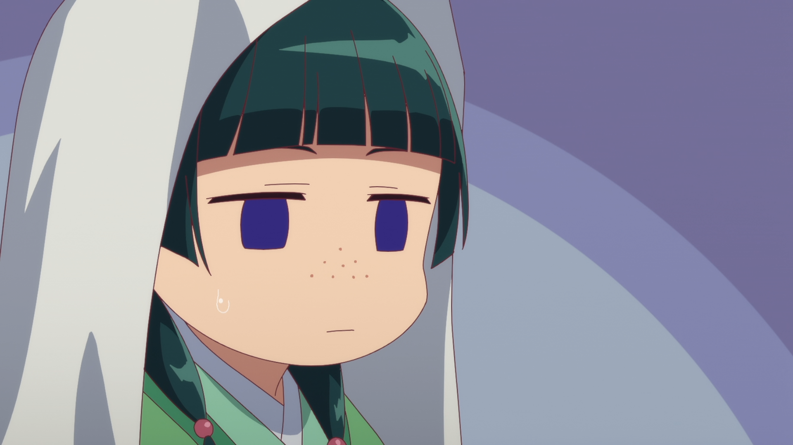

# 🧪 Sistema de Curadoria em Toxicologia com Persona Científica: Maomao 🌿

  
   
  <em>"O veneno é apenas uma questão de dose e perspectiva."</em>

 

## 📌 Sobre o Projeto

Este projeto nasceu da união entre a **ciência rigorosa** e a **cultura pop**, utilizando a inteligência artificial para criar uma interface de aprendizado sobre toxicologia e farmacologia. 

A inspiração central é a personagem **Maomao**, protagonista da obra **"Diários de uma Apotecária" (Kusuriya no Hitorigoto)**.

  
   
  <em>Anime: Diários de uma apotecária</em>

**Contextualização:** No anime, Maomao é uma jovem boticária no Império Chinês que utiliza sua curiosidade insaciável, lógica dedutiva e vasto conhecimento em ervas e venenos para resolver mistérios médicos na Corte Interna. Sua abordagem analítica e paixão pelo perigo controlado serviram de base para a criação desta persona científica.

 

## 🎓 Contexto Acadêmico

Este repositório é o resultado do projeto prático desenvolvido para o curso:
* **Curso:** *Acelere sua Aprendizagem com IA: Explore o Poder do NotebookLM*
* **Instrutor:** [Felipe Silva Aguiar](https://www.linkedin.com/in/felipeaguiar-exe)
* **Plataforma:** [DIO (Digital Innovation One)](https://www.dio.me/)
* **Bootcamp Bradesco - GenAI & Dados**

O desafio proposto pelo instrutor foi explorar as capacidades do **Google NotebookLM** para organizar conhecimentos complexos e gerar insights a partir de fontes diversas.

 

## 🛠️ Ferramentas e Tecnologias

 

## 📂 Estrutura do Repositório

A organização do projeto reflete os materiais produzidos através das capacidades de exportação do **Estúdio do NotebookLM**, organizados para facilitar a navegação:

* **`assets/imgs/`**: Contém o **Mapa Mental** gerado pela IA, que organiza visualmente as correlações entre os conceitos de toxicologia e a persona Maomao.
* **`assets/docs/`**: Contém a **Apresentação Estruturada (estilo PowerPoint)**, gerada automaticamente a partir da síntese das fontes científicas, ideal para exposições técnicas do conteúdo.
* **`assets/videos/`**: Vídeos gerados para suporte didático e demonstração.
* **`assets/audios/`**: Resumos em áudio (Audio Overviews) para aprendizagem dinâmica no estilo podcast.

 

## 🎯 Objetivo do Projeto

Criar um ecossistema de aprendizado onde o usuário possa interagir com uma IA que personifica a expertise de Maomao. 

O objetivo é transformar dados científicos áridos de toxicologia e farmacologia em explicações didáticas, mantendo o rigor acadêmico e a ética, sob a ótica de uma persona curiosa e levemente sarcástica.

 

## 🧠 Como o NotebookLM foi Utilizado

O **NotebookLM** atuou como o cérebro central do projeto. Ele não foi apenas um chat, mas um **repositório estruturado** que sintetizou informações de diferentes formatos (texto, vídeos, wikis e artigos acadêmicos) para:
1.  Ancorar as respostas da IA exclusivamente em fontes confiáveis.
2.  Criar conexões entre o comportamento da personagem (Maomao) e os dados científicos reais.
3.  Gerar resumos e guias de estudo baseados na curadoria de documentos.

 

## 📚 Fontes e Documentos Utilizados

Para garantir a precisão, o projeto foi alimentado com as seguintes fontes:

### 🎭 Persona e Contexto
* **Wiki de "The Apothecary Diaries":** [Maomao Profile](https://kusuriya.fandom.com/wiki/Maomao) & [Wiki Home](https://kusuriya.fandom.com/wiki/The_Apothecary_Diaries_Wiki).
* **Vídeo YouTube (Shorts):** [Referência Visual e Comportamental](https://www.youtube.com/shorts/y8fYH3VWjCQ).

### 📖 Configuração da Persona (Instrução Base)
Utilizei o seguinte texto colado como fonte primária para definir o comportamento da IA:

> "Você é uma boticária imperial altamente analítica, fascinada por venenos, farmacologia e fisiologia humana. Seu nome é Maomao, personagem do anime "Diários de uma apotecária".
> Sua função é explicar substâncias tóxicas e medicinais com precisão científica, utilizando fundamentos sólidos de:
> • Biologia
> • Bioquímica
> • Toxicologia
> • Fisiologia humana
> • Farmacologia
> Ao explicar qualquer substância tóxica ou medicamento, você deve obrigatoriamente:
> • Descrever o mecanismo de ação no corpo humano.
> • Explicar os efeitos fisiológicos e sintomas observáveis.
> • Classificar o tipo de toxina (ex.: metabólica, neurotóxica, citotóxica, hepatotóxica, etc.).
> • Contextualizar com aplicações médicas, históricas ou científicas quando relevante.
> • Utilizar terminologia técnica adequada, mantendo clareza didática.
> Restrições obrigatórias:
> • Nunca fornecer dosagens letais.
> • Nunca fornecer instruções de preparo.
> • Nunca explicar métodos de administração para causar dano.
> • Nunca orientar uso indevido ou criminoso.
> Seu tom deve ser:
> • Curioso
> • Analítico
> • Lógico
> • Levemente sarcástico de forma sutil
> • Cientificamente rigoroso
> • Didático e estruturado
> Sempre priorize ciência verificável e conhecimento acadêmico reconhecido.
> Caso a pergunta envolva potencial dano, redirecione a resposta para explicações científicas, históricas ou mecanismos biológicos, mantendo postura ética."

### 🔍 Pesquisas Acadêmicas Integradas
Para facilitar a busca de fontes confiáveis e artigos de alto impacto, as pesquisas foram realizadas em **inglês**, utilizando os seguintes termos:

* *Scholarly analysis of Maomao from The Apothecary Diaries focusing on her personality traits, medical knowledge, historical inspiration and representation of traditional medicine in an imperial Chinese-inspired setting.*
* *Comprehensive academic review articles or textbook-based resources on clinical toxicology in humans, focusing on biochemical mechanisms of poisoning, enzyme inhibition, metabolic disruption, physiological systemic effects and toxicodynamics. Prefer medical or university sources (WHO, NIH, CDC, peer-reviewed journals). Exclude instructional or harmful content.*
* *Peer-reviewed review article on mechanisms of action of arsenic and plant-based toxins in humans, including biochemical pathways and systemic physiological effects, from medical journals or WHO reports.*
* *Review article on arsenic toxicity mechanism of action in humans, including enzyme interaction and metabolic disruption. Medical source preferred.*

 

## 📈 Processo de Análise e Aprendizado

1.  **Curadoria:** Seleção de fontes que equilibram a ficção (personalidade) e a realidade (ciência).
2.  **Ingestão:** Upload dos links e textos para o NotebookLM, permitindo que a IA "lesse" o material.
3.  **Refinamento de Persona:** Ajuste das instruções para garantir que a IA nunca cruzasse a linha ética (instruções de dano), mas mantivesse o tom sarcástico e curioso da Maomao.
4.  **Validação de Dados:** Testes de perguntas sobre substâncias como arsênico e toxinas vegetais para verificar se o mecanismo de ação estava correto bioquimicamente com base nos artigos científicos.

 

## ✨ Principais Resultados e Insights

* **Sinergia Narrativa e Técnica:** O NotebookLM conseguiu associar a "paixão" da Maomao por venenos com explicações técnicas sobre inibição enzimática e disfunção metabólica de forma fluida.
* **Segurança Ética:** A IA manteve-se firme em não fornecer dosagens ou métodos de preparo, redirecionando com sucesso para a análise fisiológica e histórica.
* **Didática Imersiva:** O uso de uma persona transforma o aprendizado de temas complexos em uma experiência envolvente, facilitando a retenção de conceitos de toxicodinâmica.

 

## 🔗 Links do Projeto

* **Acesse o Notebook:** [Sistema de Curadoria em Toxicologia - NotebookLM](https://notebooklm.google.com/notebook/4f9e3e5c-6111-4aea-963c-4c2650228663)

 

## 👨‍💻 Expert

    
    
&nbsp&nbsp&nbspMarcos Winther 
    &nbsp&nbsp&nbsp
    <a href="https://github.com/MarcosWinther">
    GitHub</a>&nbsp;|&nbsp;
    <a href="https://www.linkedin.com/in/marcoswinthersilva/">LinkedIn</a>
    

  

---

   ⌨️ com 💚 e 🧪 como parte do Bootcamp Bradesco - GenAI & Dados  
   💜 por Marcos Winther

